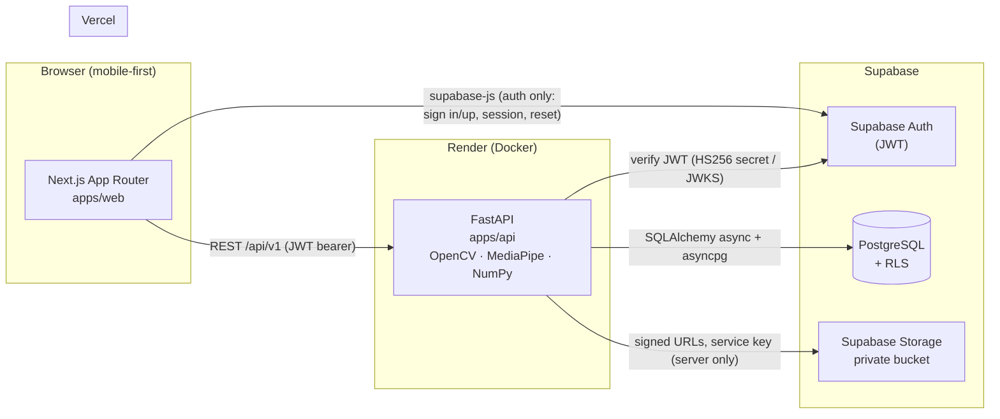
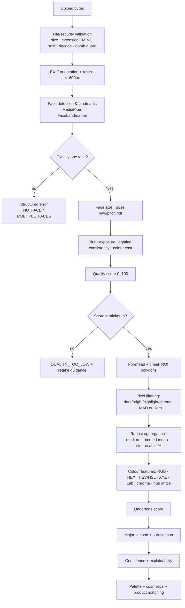

# Architecture — Smart Personal Colour Analysis System (ColourSense)

## 1. System overview



**Trust boundaries**
- The browser is untrusted. It holds only the Supabase **anon** key and the user's own JWT.
- FastAPI is the single application API. It verifies the Supabase JWT on every protected route and enforces ownership/role checks in queries.
- RLS + storage policies independently lock down the *direct* Supabase surface (PostgREST/Storage reachable with the anon key), so a bypass of the app API still cannot read other users' data.
- The Supabase service-role key exists **only** in the backend environment. It is never sent to the browser and never committed.

## 2. Monorepo layout

```text
apps/web                 Next.js (App Router, TS strict, Tailwind, shadcn/ui, TanStack Query)
apps/api                 FastAPI (Python 3.12, uv, OpenCV, MediaPipe, SQLAlchemy async)
packages/contracts       zod schemas + TypeScript types for /api/v1 payloads
packages/colour-engine   Versioned classifier configuration (classifier-v1.json) + docs
supabase/migrations      SQL migrations (schema + RLS + storage policies)
supabase/seed.sql        Seed data (seasons, palettes, cosmetics, demo stores/products)
docs/                    Technical + FYP documentation
scripts/                 Dev/CI helpers (db reset, RLS verification, smoke tests)
test-assets/             Licence-documented test fixtures (generated, public domain)
.github/workflows        CI pipelines
```

## 3. Backend organisation

```text
apps/api/app
├── api/v1/          # thin routers only (health, analyses, seasons, products, admin, me)
├── core/            # settings (validated at startup), logging, request-id middleware, errors
├── schemas/         # Pydantic request/response models (mirror of packages/contracts)
├── repositories/    # SQL access (SQLAlchemy core/ORM, ownership enforced here)
├── services/        # orchestration: analysis persistence, products, imports, admin, storage
├── security/        # JWT verification (HS256 + JWKS), role guards, rate limiting
└── analysis/        # the deterministic pipeline (pure, framework-free)
    ├── preprocessing/    # decode, EXIF, resize, bomb protection
    ├── face_detection/   # MediaPipe FaceLandmarker wrapper (lazy singleton)
    ├── landmarks/        # anchor points, geometry helpers
    ├── quality/          # blur, exposure, lighting, cast, pose, face-size, quality score
    ├── skin_regions/     # forehead/cheek ROI polygons, pixel filtering, aggregation
    ├── colour_features/  # sRGB/XYZ/Lab/HSV/HSL/hex, chroma, hue angle, CIEDE2000
    ├── classification/   # undertone, major season, sub-season (config-driven)
    ├── confidence/       # confidence factors and labels
    └── explainability/   # evidence/warning/tip generation
```

Rules:
- Routers never contain pipeline logic; they call services.
- `analysis/*` is pure and deterministic: same image + same config ⇒ same result. No I/O except the loaded MediaPipe model.
- All thresholds come from `packages/colour-engine/config/classifier-v1.json` (loaded and validated at startup, exposed via `algorithm_versions`).

## 4. Image-analysis pipeline



Every stage returns a structured result; failures map to typed error codes (`error.code`) with friendly messages.

## 5. Data model (summary)

Conceptual groups (full ERD in `docs/database-schema.md`):
- **Users:** `profiles` (role: user/admin), `user_preferences`, `user_consents`
- **Analyses:** `analyses`, `analysis_quality_metrics`, `analysis_colour_samples`, `analysis_classifications`, `analysis_images`, `algorithm_versions`
- **Palettes:** `colour_seasons`, `colour_subseasons`, `palette_colours`, `cosmetic_recommendations`, `user_favourite_colours`
- **Commerce:** `stores`, `products`, `product_colours`, `product_season_tags`, `user_favourite_products`, `product_import_jobs`, `product_import_errors`
- **Admin:** `admin_audit_logs`, `content_pages`, `system_settings`

UUID PKs, FKs with `ON DELETE CASCADE` for user-owned data (account deletion), `created_at`/`updated_at` with triggers, RLS on all user-owned and admin-managed tables.

## 6. Authentication & authorisation

- Supabase Auth issues JWTs; frontend attaches `Authorization: Bearer <access_token>` to API calls.
- Backend verifies: HS256 via `SUPABASE_JWT_SECRET` **or** asymmetric keys via the project JWKS endpoint (cached). Audience `authenticated`.
- Roles: `profiles.role ∈ {user, admin}` — checked server-side per request for admin routes (never trusted from the client).
- Guests: analysis endpoints work without a token; results are returned but never persisted; no image is stored.

## 7. Deployment

- **Vercel** builds `apps/web` (pnpm monorepo root, project root = `apps/web`).
- **Render** runs `apps/api` from the production Dockerfile (single uvicorn worker, healthcheck on `/api/v1/health`).
- **Supabase** hosts Postgres, Auth, Storage; migrations applied via SQL editor or CLI; private bucket `analysis-images`.
- CI: GitHub Actions — path-filtered web/api workflows + a database workflow that applies migrations and runs the RLS verification script against a service Postgres.

## 8. Key qualities

- **Deterministic & explainable:** rule-based engine, versioned config, evidence strings.
- **Private by default:** guest images never persisted; opt-in storage; signed URLs; deletion flows.
- **Testable:** pure pipeline modules; licence-clean generated fixtures; RLS proven by script.
- **Honest:** no AI/accuracy claims; confidence and limitations surfaced in the UI.
