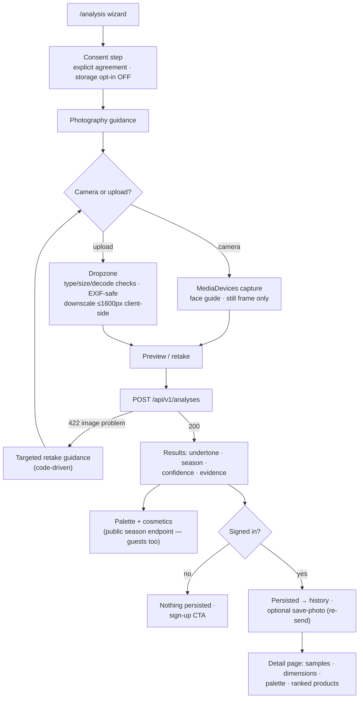
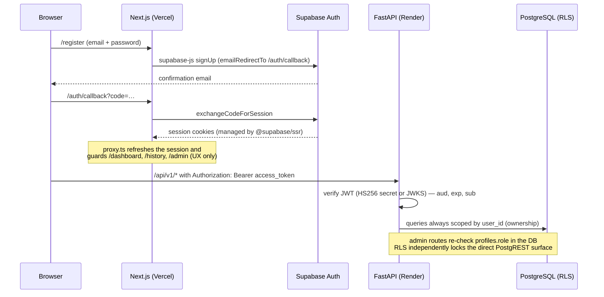

# Architecture

The complete architecture (system diagram, trust boundaries, backend layout, pipeline flowchart, data-model summary) lives in the root [`ARCHITECTURE.md`](../ARCHITECTURE.md); the database ERD is in [`database-schema.md`](./database-schema.md) and the deployment topology in [`deployment-guide.md`](./deployment-guide.md). This page adds the remaining required flows.

## User analysis flow

## Authentication flow

## Key decisions

Recorded in [`DECISIONS.md`](../DECISIONS.md): rule-based baseline (D-001), CIE Lab + CIEDE2000 (D-002), MediaPipe with a vendored model (D-003), process-only-by-default image retention (D-004), dual-layer authorisation (D-005), config versioning (D-007), landmark-anchored elliptical ROIs (D-013), documented product-ranking formula (D-014).
