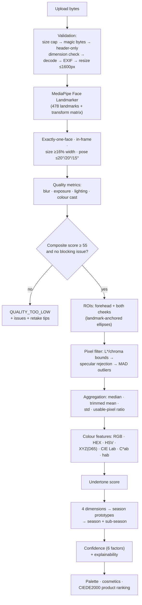

# Colour-Analysis Methodology

The engine is **rule-based and deterministic**: documented colour science + configurable thresholds + explainable scoring. It is not a trained ML model and no accuracy statistics are claimed (see `docs/fyp-methodology-summary.md` for the evaluation framing). Every tunable number lives in `packages/colour-engine/config/classifier-v1.json` and every result is stamped with that version.

## 1. Pipeline overview

## 2. Colour science

- **sRGB → linear**: exact IEC 61966-2-1 piecewise transfer function.
- **linear → XYZ**: standard sRGB/D65 matrix; **XYZ → CIE L\*a\*b\***: CIE 1976 with D65 reference white (Xn 0.95047, Yn 1, Zn 1.08883) and the 216/24389 ε, 24389/27 κ constants.
- Derived: chroma `C*ab = √(a*²+b*²)`, hue angle `hab = atan2(b*, a*)`.
- Verified against canonical values (D65 white → L\*=100; `#808080` → L\*≈53.585; sRGB primaries) and vectorised == scalar equivalence.
- **CIEDE2000** implements Sharma, Wu & Dalal (2005) and passes **all 34 published reference pairs** at 1e-4.

## 3. Skin-region extraction (spec §14)

Regions are **elliptical polygons anchored to facial geometry** — never fixed pixel boxes:

| Region | Anchors | Placement |
|---|---|---|
| Forehead | glabella (idx 9) → face-oval top (idx 10) | centre at 52% of that segment; semi-axes 0.34/0.16 × face width; rotated with the eye line |
| Cheeks | lower eyelid (145/374) → mouth corner (61/291), pushed toward face edge (234/454) | centre at 50% eyelid→mouth, +28% toward the edge; semi-axes 0.16/0.13 × face width |

Pixel cascade per ROI: keep `18 ≤ L* ≤ 93` and `C*ab ≤ 55`; reject speculars (`L* > 90` with `C* < 8`); then median-absolute-deviation rejection on each Lab axis (`k = 3`, 1.4826 scaling). Aggregate with the median and a 20% trimmed mean; report std and usable-pixel ratio. The combined sample weights regions by usable pixels. Analysis is rejected (`LOW_USABLE_SKIN_AREA`) if no region clears 400 usable pixels.

## 4. Undertone (spec §16)

Signals mapped to [−1 (cool), +1 (warm)] and combined with configured weights:

| Signal | Cool ≤ | Warm ≥ | Weight |
|---|---|---|---|
| hue angle hab | 47° | 53° | 0.55 |
| b\* | 14 | 19 | 0.30 |
| per-region hue agreement | — | — | 0.15 |

Optional questionnaire (gold/silver jewellery, sun reaction) adjusts by at most ±0.12. |score| ≤ 0.16 ⇒ internal **neutral**; quality < 60 ⇒ internal **uncertain**; the public output is always warm/cool with the nuance carried by confidence and wording.

## 5. Seasonal classification (spec §17–18)

Four normalised dimensions:

- **temperature** = (undertone score + 1)/2
- **value** from skin L\* mapped over [35, 75]
- **chroma** from C\*ab mapped over [14, 34]
- **contrast** = 0.35 × ROI-L\*-spread proxy + 0.65 × questionnaire (default 0.5)

Season score = `1 − Σ w_d · |dim_d − prototype_d|` with weights (0.40, 0.25, 0.20, 0.15) against the four prototype vectors in config. The top-two margin feeds confidence. Sub-seasons resolve by prioritised axis rules (light ≥ 0.62 value, deep ≤ 0.38, bright ≥ 0.62 chroma, soft ≤ 0.38; temperature-true default) and are **displayed only when confidence ≥ 0.60**.

## 6. Confidence (spec §19)

Weighted sum of six factors, all in [0, 1]: image quality (0.30), ROI consistency via CIEDE2000 between cheeks and cheeks↔forehead mapped from ΔE 4→1 to 12→0 (0.20), usable skin area (0.15), classification margin 0.04→0.18 (0.20), colour-cast penalty (0.10), questionnaire agreement (0.05). Labels: high ≥ 0.80, medium ≥ 0.60, low below. Confidence is deliberately separate from classification scores.

## 7. Product ranking (spec §23.1)

`score = 0.5·paletteProximity + 0.2·seasonTag + 0.1·subSeasonTag + 0.1·categoryRelevance + 0.1·availability`, where `paletteProximity = max(0, 1 − minΔE00/25)` against the analysis's recommended palette (cautious group excluded). Category relevance is an editorial weighting (face-adjacent garments 1.0 → shoes/bags 0.6). Product photography may not represent real-world colour, and the UI says so.

## 8. Known limitations

Single uncalibrated photo; white balance and lighting dominate error; no physical reference card; contrast dimension is weak without the questionnaire; sub-season boundaries are heuristic; thresholds are documented choices, not fitted parameters. See `docs/future-work.md`.
