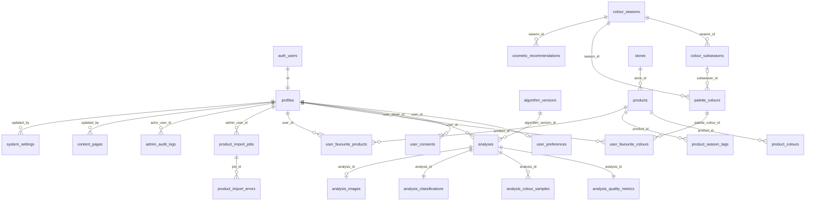

# Database Schema

PostgreSQL (Supabase) schema for the Smart Personal Colour Analysis System. Source of truth: `supabase/migrations/` (applied in filename order). Seed data: `supabase/seed.sql` (generated by `scripts/generate_seed.py`).

## Conventions

- UUID primary keys (`gen_random_uuid()`); `created_at`/`updated_at` on mutable tables with an automatic `set_updated_at()` trigger.
- Foreign keys with `ON DELETE CASCADE` for user-owned data (account deletion removes everything the user owns) and `ON DELETE SET NULL` where history must survive (e.g. audit logs after an admin account is removed).
- Season/sub-season references from `analyses` and `product_season_tags` are **slugs, not FKs** — admin edits to the palette catalogue can never mutate or break historical results.
- CHECK constraints on every enum-like column; hex colours validated as `^#[0-9a-f]{6}$`; URLs validated as http(s).
- Row Level Security enabled on every table (`0007_rls.sql`), storage policies on the private image bucket (`0008_storage.sql`). Proven by `scripts/verify_rls.py` (21 checks) in CI.

## Entity-relationship diagram



## Table groups

### Users (`0002_users.sql`)
| Table | Purpose | Notable rules |
|---|---|---|
| `profiles` | One row per auth user; holds `role ∈ {user, admin}` | Auto-created by `handle_new_user()` trigger on `auth.users`; role changes on the PostgREST surface blocked for non-admins by trigger |
| `user_preferences` | Per-user settings | `default_image_storage` defaults **false** (privacy) |
| `user_consents` | Append-only consent event log | Latest row per `(user, consent_type)` is current state; no UPDATE/DELETE policies |

### Analyses (`0004_analyses.sql`)
| Table | Purpose | Notable rules |
|---|---|---|
| `algorithm_versions` | Classifier config snapshots | Full JSON config stored for reproducibility |
| `analyses` | One saved analysis per row | `user_id NOT NULL` — guests are never persisted |
| `analysis_quality_metrics` | Component quality scores (1:1) | All scores 0–100 with CHECKs |
| `analysis_colour_samples` | Per-region colour features | Unique `(analysis_id, region)`; RGB/HSV/Lab/chroma/hue |
| `analysis_classifications` | Season scores, dimensions, explanations (1:1) | Evidence/warnings/tips as JSON arrays |
| `analysis_images` | Opt-in stored image metadata (1:1) | Path unique; owner denormalised for storage policy alignment |

### Palettes (`0003_palettes.sql`)
`colour_seasons` (4) → `colour_subseasons` (12) → `palette_colours` (seeded 156, with CIE Lab for CIEDE2000 matching, `palette_group ∈ {neutrals, core, accents, formal, casual, accessories, headwear, cautious}`) and `cosmetic_recommendations` (48). `user_favourite_colours` joins users to palette colours.

### Commerce (`0005_commerce.sql`)
`stores` → `products` (12 categories, `is_demo` flag for seeded records) → `product_colours` (hex + Lab) and `product_season_tags` (slug-based). `user_favourite_products`, plus `product_import_jobs`/`product_import_errors` for CSV imports (dry-run + row-level errors).

### Administration (`0006_admin.sql`)
`admin_audit_logs` (append-only trail of admin mutations), `content_pages` (admin-editable public content), `system_settings` (key/JSONB configuration).

## RLS model (summary)

| Surface | Rule |
|---|---|
| `analyses*`, `analysis_images` | Owner-only for every operation. **No admin read policy by design** — administrators must not browse users' analyses or images; admin statistics are anonymised backend aggregates. |
| `profiles`, `user_preferences`, `user_consents`, favourites | Owner-only (profiles readable by admins for user management; consents append-only). |
| Catalogue (seasons, sub-seasons, palettes, cosmetics, stores, products, colours, tags) | Public read of active rows (including anonymous); admin-only writes. |
| `product_import_*`, `admin_audit_logs`, `system_settings` | Admin-only (audit log append-only). |
| `content_pages` | Public read when published; admin writes. |
| Storage `analysis-images` bucket | Private; object path `<user_id>/…`; owner-only select/insert/update/delete via first path segment = `auth.uid()`. |

Verification: `scripts/verify_rls.py` — run locally with `uv run --project apps/api python scripts/verify_rls.py` after `scripts/db-reset.sh`; runs automatically in `db-ci.yml`.

## Local development

```bash
docker compose up -d db     # postgres:16 on port 54329
./scripts/db-reset.sh       # auth shim + migrations + seed (LOCAL ONLY)
```

The auth shim (`scripts/db/auth_shim.sql`) recreates the Supabase pieces migrations rely on (`auth.users`, `auth.uid()`, `anon`/`authenticated` roles with Supabase-style grants). **Never apply the shim or `db-reset.sh` to a Supabase project** — production applies only `supabase/migrations/*.sql` + `supabase/seed.sql` (see the deployment guide).
